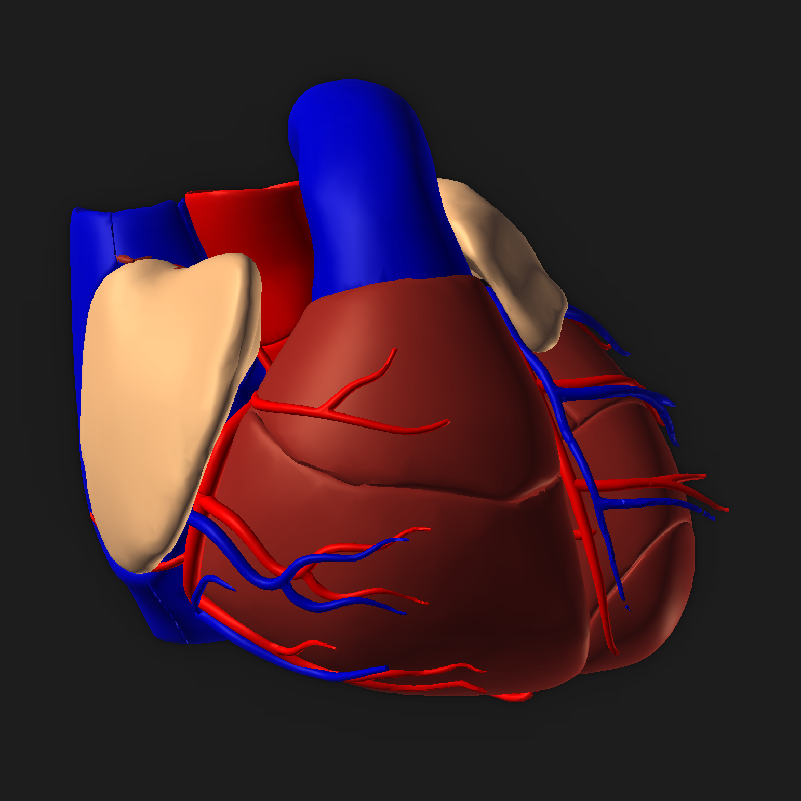

# Interactive 3D Human Heart Visualization

Visualization [here](https://ippon1.github.io/Interactive-3D-Human-Heart-Visualization/)

## Functionality
* On the right top corner you can select part of the organ. This will be emphasized and on the right side a fitting wikipedia Article will be added.
* If one organ hides another one you can remove parts of the heart to get a better look.

## Controls
* The Visualization can be rotated by dragging the mouse. For translation on Mac the CONTROL key has to be pressed.
* If you click at one anatomical structure the visibility will be set to false.
* To select and highlight an object and get further informations there is a menu at the top right corner. 

## Color scheme for the different kinds of anatomical structures
Organ structures | color
--- | --- 
Coronary arteries | red
Pulmonary vein | red
Aorta | red
Coronary veins | blue
Pulmonary arteries | blue
Vena cava superior and inferior | blue
Trabecular muscle | saddlebrown
Myocard | brown
right and left Auricle | #ffc0a1
Heart valve | lightblue

# Sources:
## Libraries and Data
* [threejs](https://threejs.org/)
* [jquery](https://jquery.com/)
* [Wikipedia](https://en.wikipedia.org)
* Model: BodyParts3D, © The Database Center for Life Science licensed under CC Attribution-Share Alike 2.1 Japan ([Link](http://lifesciencedb.jp/bp3d/?fbclid=IwAR1KWPydXGal56TpQECD6nJsdcyhLHbElKpUotss5UFEw22KZFBliX3ugtY))

## Tutorials
* [Menu](https://stackoverflow.com/questions/22896144/drop-down-menu-not-work)
* [Sort Menu](https://stackoverflow.com/questions/5248189/sort-select-menu-alphabetically)
* [Object Loader](https://threejs.org/examples/webgl_loader_obj2_options)
* [Bloom Effect](https://threejs.org/examples/webgl_postprocessing_unreal_bloom_selective)

# TODOs
* Remove Structure instead of just hide
* Make UI more beautiful
* Add MIT Lizenz
* Make App better compatible for mobile 
* Implement a backlog so COMAND + Z can be used
* Make responsive Web APP
* When resizing keep center in the center
* https://github.com/shama/webpack-stream
* https://gulpjs.com/

## Acknowledgment
This project was created for the course [Visualisierung Medizinischer Daten 2](https://www.cg.tuwien.ac.at/courses/MedVis2/VU.html) at [TU Wien](https://www.cg.tuwien.ac.at). It was rewarded full points.
